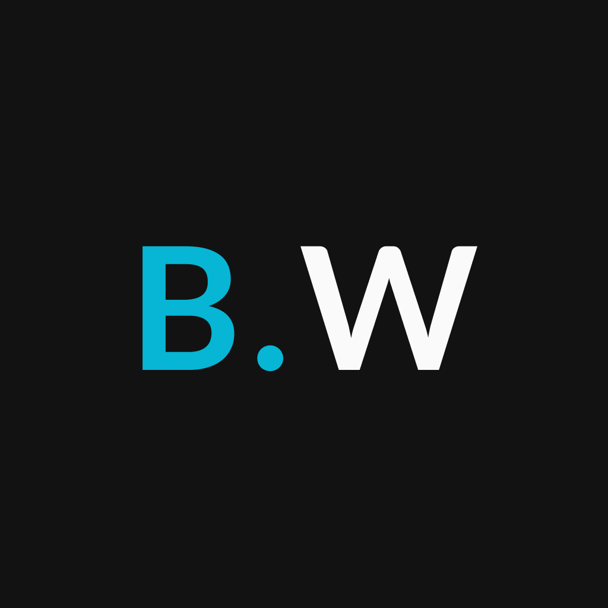

<p align="center">
  
</p>
<h1 align="center">
  B.Weather
</h1>

<!-- Badges -->
<p align="center">
  <!-- if your  -->
  <a href="https://github.com/henry-ns/b.weather/graphs/commit-activity" alt="Maintenance">
    
  </a>

  <!-- License -->
  <a href="./LICENSE" alt="License: MIT">
    
  </a>

  <!-- codefactor -->
  <a href="https://www.codefactor.io/repository/github/henry-ns/b.weather" alt="CodeFactor">
    
  </a>

  <br/>

  

  <!-- version -->
  

  <!-- GitHub repo size -->
  

  <br/>

  <!-- langs -->
  <a href="./README.md" alt="CodeFactor">
    
  </a>

  <a href="./README.pt.md" alt="CodeFactor">
    
  </a>
</p>

<!-- summary -->
<p align="center">
  <a href="#clipboard-description">Description</a>&nbsp;&nbsp;&nbsp;|&nbsp;&nbsp;&nbsp;
  <a href="#iphone-running-at-expo">Running at Expo</a>&nbsp;&nbsp;&nbsp;|&nbsp;&nbsp;&nbsp;
  <a href="#rocket-running-locally">Running locally</a>&nbsp;&nbsp;&nbsp;|&nbsp;&nbsp;&nbsp;
  <a href="#-whats-inside">What's inside?</a>&nbsp;&nbsp;&nbsp;|&nbsp;&nbsp;&nbsp;
  <a href="#memo-license">License</a>
</p>

## :clipboard: Description
B.Weather is a current weather and weather forecast app for your location. It was initially developed as a technical challenge for React Native at [Builders](https://platformbuilders.io).


## :iphone: Running at Expo
  You can see the latest version of the app available on the Expo Store, to run on your smartphone, just download the Expo app from the app store and scan the QR Code below, or by accessing [here](https://exp.host/@henry-ns/b-weather?release-channel=default):

<p align="center">
  </img>
</p>

## :rocket: Running locally

1. Download the repository

  - Using Git
```shell
  git clone https://github.com/henry-ns/b.weather.git
```
  - Using Github CLI
```shell
  gh repo clone henry-ns/b.weather
```
  > :bulb: or in whatever way you prefer

2. Installation

Inside the repository folder, run the following command:

  ```shell
    yarn install
  ```

  > :bulb: You can use any package manager you like, such as `npm` or `pnpm`.

1. Execution

To run on iOS emulator, run the following command:

  ```shell
    yarn ios
  ```

To run on Android emulator, run the following command:
  ```shell
    yarn android
  ```

  > :bulb: For more detailed information, access the [Expo](https://docs.expo.dev/tutorial/planning/) documentation.

## 🧐 O que tem dentro?

### :building_construction: Technologies
- [Expo](https://docs.expo.dev)
- [React Native](https://reactnative.dev)

### :lipstick: Linter Tools
- [Eslint](https://eslint.org/)
- [EditorConfig](https://editorconfig.org/)
- [Lint Staged](https://github.com/okonet/lint-staged)
- [Prettier](https://prettier.io/)

### :package: Packages

  - [Axios](https://axios-http.com)
  - [date-fns](https://date-fns.org)
  - [Expo Google Font Lato](https://www.npmjs.com/package/@expo-google-fonts/lato)
  - [Expo location](https://docs.expo.dev/versions/latest/sdk/location/)
  - [NativeBase](https://nativebase.io)
  - [React Navigation](https://reactnavigation.org)

### A quick look at the directories inside the `./src`.
    ./src
     ├── components
     ├── enums
     ├── hooks
     ├── routes
     ├── services
     ├── styles
     ├── types
     ├── utils

1.  **`components`**: folder with application components following the [Atomic Design](https://bradfrost.com/blog/post/atomic-web-design/) pattern.

2. **`enums`**: folder with the application's enums

3. **`hooks`**: custom react hooks.

4. **`routes`**: application routes.

5. **`services`**: Third party services used.

6. **`styles`**: global styles.

7. **`types`**: folder with application types.

8. **`utils`**: recurring utility functions.

## :memo: Licença

This project is under the MIT license. See the file [LICENSE](LICENSE) for more details.

---

Build with 💙 by [Henrique](https://henrique.pw)
